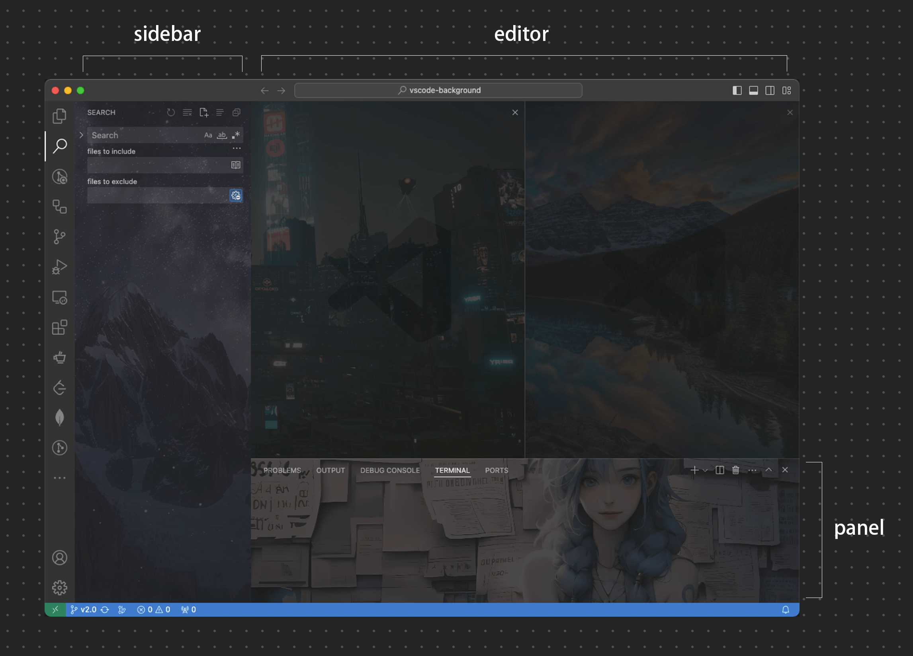

## v2.0.7 (2025/11/19)

- Change automatic update to manual by @shalldie in [#569](https://github.com/shalldie/vscode-background/pull/569)
- 自动更新替换为手动 by @shalldie in [#569](https://github.com/shalldie/vscode-background/pull/569)

**Full Changelog**: https://github.com/shalldie/vscode-background/compare/v2.0.5...v2.0.7

## v2.0.5 (2025/11/16)

1. feat: Add blend mode to dark theme (#563) by @shalldie in [#566](https://github.com/shalldie/vscode-background/pull/566)
2. fix: A more precise editor selector by @shalldie in [#530](https://github.com/shalldie/vscode-background/issues/530)

---

1. feat: 深色主题添加混动模式 (#563) by @shalldie in [#566](https://github.com/shalldie/vscode-background/pull/566)
2. fix: editor 使用更明确的选择器 by @shalldie in [#530](https://github.com/shalldie/vscode-background/issues/530)

## v2.0.4 (2025/11/12)

1. Feat folder - Add support for different system paths and folders, support by @shalldie and @Remhardt in [#557](https://github.com/shalldie/vscode-background/pull/557)
2. Add auxiliary bar support by @suiyun39 in [#544](https://github.com/shalldie/vscode-background/pull/544)

---

1. Feat folder - 添加对不同系统路径、以及文件夹的支持。By @shalldie and @Remhardt in [#557](https://github.com/shalldie/vscode-background/pull/557)
2. 添加辅助面板配置 by @suiyun39 in [#544](https://github.com/shalldie/vscode-background/pull/544)

---

## v2.0.3 (2024/11/14)

- add code-server support (添加了 code-server 支持) by @shalldie in [#498](https://github.com/shalldie/vscode-background/pull/498)
- fix: add patch lockfile for multiple instances (添加了文件锁应对多实例同时写入) by @shalldie in [#500](https://github.com/shalldie/vscode-background/pull/500)

## v2.0.2 (2024/11/09)

- docs: Update README（README 整理） by @Octopus058 in [#480](https://github.com/shalldie/vscode-background/pull/480)
- (fix #479) docs: updated localization for Japanese by @shim4stat in [#483](https://github.com/shalldie/vscode-background/pull/483)
- Feat fullscreen optimization（全屏方案优化） by @shalldie in [#484](https://github.com/shalldie/vscode-background/pull/484)
- Preload images. 图片预加载 by @shalldie
- fix(l10n): :bug: 修复插件提示在linux下不显示为中文的问题 (fix #485) by @hbcraft in [#486](https://github.com/shalldie/vscode-background/pull/486)
- Fix backup when upgrading vscode through package manager in some Linux by @shalldie in [#493](https://github.com/shalldie/vscode-background/pull/493)

## v2.0.1 (2024/10/28)

1. Add `0.8` opacity to minimap by default. (#475)
2. Fix `background.editor.styles` should follow `images`. (#476)

---

1. 现在会默认给 `minimap` 添加一个0.8的透明度。 (#475)
2. 修复了 `background.editor.styles` 没有跟随 `images` 的问题。 (#476)

---

## v2.0.0 (2024/10/23) (#462)

This is a major version that has added more features, which will bring you a better coding experience!

1. More configurable sections: `fullscreen`, `sidebar`, `editor`, `panel`.
2. Clear and concise configuration.
3. Added quick commands that can be invoked through the 「Background」 button in the bottom-right corner of the statusbar.
4. No more warnings about `Your Code installation appears to be corrupt` !!!
5. Added support for multiple languages (l10n).
6. More content can be found in [README.md](./README.md)，[Migration from v1](./docs/migration-from-v1.md)。

这是一个大版本，增加了更多的功能，会给你带来更好的编码体验！

1. 更多的可配置区域：`全屏`、`侧边栏`、`编辑器`、`面板`。
2. 更清晰简洁的配置。
3. 添加了快捷命令，可以通过右下角「background」按钮唤起。
4. 不再有令人厌烦的 `Code 安装似乎损坏` 提示 !!!
5. 添加了多语言（l10n）支持。
6. 更多内容可见 [README.md](./README.md)，[从 v1 迁移](./docs/migration-from-v1.md)。

## ver1.2.16 (2024/10/09)

    #468, #458
    add statusbar to show all commands.
    添加状态栏按钮，用于快速展示所有命令。

## ver1.2.15 (2024/10/06)

    merge #466
    update vscode base dir.

## ver1.2.13 (2023/11/13)

    merge #420, fix #416, #412, #399
    修复了一些样式、配置的问题。
    Fix some problems with css and config.

## ver1.2.12 (2023/6/10)

    fix #400, #401
    兼容低版本vsocde全屏css选择器
    Compatible with lower version vsocde full screen CSS selector

## ver1.2.11 (2023/6/8)

    fix #374, #328, merge #399
    调整字段，更新全屏图片加载时机
    Adjust the fields and update the loading time of the full screen image

## ver1.2.10 (2023/6/5)

    fix #392, merge #393
    添加对图片协议的校验
    Add verification of image protocol

## ver1.2.9 (2023/2/14)

    fix #372
    修复在code-server中全屏不居中的问题
    Fix the problem that the full screen is not centered in code-server

## ver1.2.8 (2022/12/15)

    merge #359, #357
    全屏模式自定义 position。添加巴西语翻译。
    custom `position` in `fullscreen`. Add PT-BR translate.

## ver1.2.7 (2022/12/5)

    fix #350
    merge #345
    修复显示问题，添加日文翻译。

## ver1.2.6 (2022/11/21)

    #341
    Add feature carrousel.
    添加轮播功能。

## ver1.2.5 (2022/11/10)

    #337
    Add a hook to remove background images, when plugin has been uninstalled.
    当插件被卸载时，添加钩子去清理背景图。

## ver1.2.3 (2022/11.3)

    #306, #329
    fix css broken caused by mutiple write.
    修复多实例写入造成的css损坏。

## ver1.2.2 (2022/10.31)

    add feature fullscreen.
    添加全屏背景图支持。

## ver1.2.1 (2022/7/20)

    fix loading local image.
    修复加载本地图片的问题。

## ver1.2.0 (2022/7/18)

    大量调整，相当部分来自：https://github.com/shalldie/vscode-background/pull/293
    main:
    Auto sudo command to install. 自动提权。
    Another way to uninstall. 额外的卸载方式。

## ver1.1.31 (2022/6/1)

    调整 web css 路径，// https://github.com/microsoft/vscode/pull/141263
    update path of web css.

## ver1.1.30 (2021/12/17)

    适配 web，比如 code-server。
    adapt to vscode web, for example code-server.

## ver1.1.29 (???)

    忘记了。
    forget.

## ver1.1.28 (2021/06/29)

    同步一下最近的更新，没有功能上的调整。
    Synchronize the latest updates.

## ver1.1.27 (2021/03/13)

    修复vscode升级带来的自定义图片问题，感谢 `NoDocCat`
    Fix the problem of custom image caused by vscode upgrade, thx for `NoDocCat`.

## ver1.1.26 (2020/07/07)

    给首屏（空白屏）添加图片。
    add image to home screen(empty screen).

## ver1.1.25 (2020/05/14)

    添加 `loop` 模式，可以循环展示图片。
    add loop mode, which can repeat your image.

## ver1.1.23 (2019/12/10)

    优化部分代码，卸载插件时自动清理样式，不一定生效,,, (依赖node)。
    optimize code, auto remove style after uninstalled (depend on node).some times it doesn't work.

## ver1.1.20 (2019/8/18)

    更新css文件地址。去掉对自定义路径的编码。
    update the address of css file.remove the encoding for custom path.

## ver1.1.19 (2018/7/6)

    更新样式。
    update style.

## ver1.1.18 (忘记什么时候更新的了。forget when)

    好像是更新文档之类。
    seems to update docs.

## ver1.1.17 (2017/11/12)

    fix bug: 在vscode更新的时候，遗漏了 非初次加载插件&&css文件未hack 的情况。
    产生原因：用ts重写的时候遗漏。
    fix bug: while vscode updated,extension can't work well.
    why it happens: My fault,i forgot it when rewrite it by typescript.Sorry...

## ver1.1.16 (2017/10/30)

    用 typescript 重写了一下，因为旧代码太恶心了。
    rewrite by typescript,because the old code is so rubbish. :D
    修复了旧版本的一个bug：插件卸载之后，注册的事件并没有dispose掉。
    fix bug: After extension has been uninstalled,the event doesn't dispose currently.

## ver1.1.14 (2017/7/3)

    Fix the bug,which "z-index" caught.
    修复背景图后置的 z-index 导致样式影响问题

## ver1.1.13 (2017/6/29)

    "background.useFront":boolean
    add config to on the top of code,or behind the code.
    添加图片前置，后置功能。

### ver1.1.12 (2017/6/27)

    Config opacity. 添加自定义透明度功能。
    remove background to the css3 [::after],so u can config opacity now!
    把background的背景移植到css3属性[::after]上，所以现在可以配置透明度。

### ver1.1.10 ver1.1.11 (2017/3/27)

    添加 minimap 透明度
    增加自定义样式功能

### ver1.1.9 (2016/12/15)

    ver.1.1.8
    修复vscode升级到1.8，导致插件不能用的问题
    ver.1.1.9
    修复背景重影的问题

### ver1.1.7 (2016/9/27)

    将 cunstomImages 修改为 customImages
    Please use customImages in your settings.json

### ver1.1.6 (2016/9/26 11:57)

    vscode升级会覆盖原css，添加处理，再次覆盖回去。。。

### ver1.1.5 (2016/9/26)

    1.将输入框改成配置文件 setting.json
    2.图片路径注入对时候，进行 encodeURI 编码，并用引号扩起来
    3.其它部分代码优化和更改

### ver1.1.4 (2016/8/30)

    之前文件名写错了...导致在linux下出错。 Sorry ... 该版本已修复.

### ver1.1.3 (2016/8/27)

    重写了所有代码。  可以自动获取vscode安装目录，去除注入js的方式，改为直接修改css。
    windows 跟 mac 已经完全支持。  Linux 相信也没问题，，，但是这个我无法测试，ahaha。

#### ver1.1.2 (2016/8/21)

    买了一台mac...于是把mac支持了。感谢 [@asteryk](https://github.com/shalldie/vscode-background/issues/2)  :D

#### ver1.1.1 (2016/8/11)

    修复vscode1.4下不能使用的问题。
