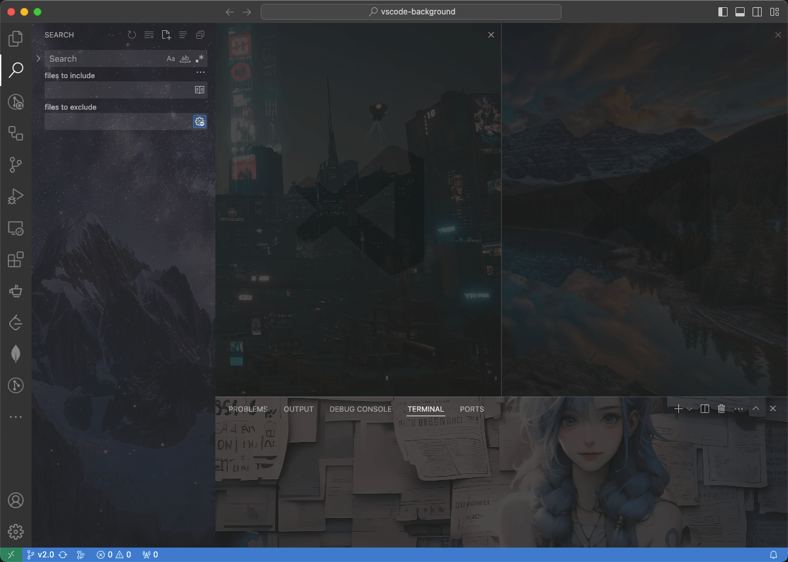
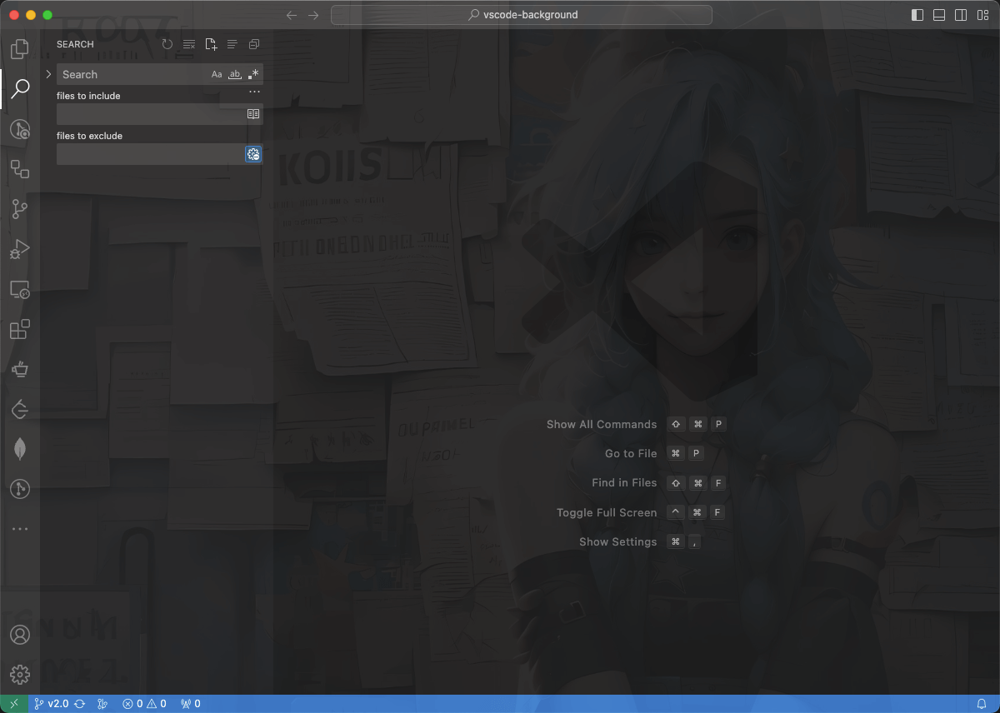

<!-- 中英文切换 -->
<div align="right">

[English](./README.md) | [中文](./README.zh-CN.md) | **日本語**

</div>
<!-- 中英文切换 end -->

<!-- 封面区域 -->
<div align="center">


<h1><b>vscode-background</b></h1>

### [Visual Studio Code](https://code.visualstudio.com) にも背景画像を。

`エディターごとの画像表示`、`全画面の画像表示`、`画像の切り替わり`、`画像・CSSのカスタマイズ`...

[GitHub](https://github.com/shalldie/vscode-background) | [Visual Studio Marketplace](https://marketplace.visualstudio.com/items?itemName=shalldie.background)

[](https://marketplace.visualstudio.com/items?itemName=shalldie.background)
[](https://marketplace.visualstudio.com/items?itemName=shalldie.background)
[](https://marketplace.visualstudio.com/items?itemName=shalldie.background)
[](https://github.com/shalldie/vscode-background)
[](https://github.com/shalldie/vscode-background/actions)
[](https://github.com/shalldie/vscode-background)

`エディタ`、`サイドバー`、`パネル`、個別に設定



`フルスクリーン`



</div>

</div>

<!-- 封面区域 end -->

## インストール

2つの方法でインストールできます：

1. [Visual Studio Marketplace](https://marketplace.visualstudio.com/items?itemName=shalldie.background)からインストール
2. vscodeの拡張機能タブから`shalldie.background`を検索

## カスタマイズ

`settings.json`からユーザー設定をカスタマイズすることができます。

[`settings.json` とは](https://code.visualstudio.com/docs/getstarted/settings#_settingsjson) | [設定方法](https://github.com/shalldie/vscode-background/issues/274)

## コンフィグ


### グローバル設定

| 設定                 |    型     | デフォルト | 説明                                       |
| :------------------- | :-------: | :--------: | :----------------------------------------- |
| `background.enabled` | `Boolean` |   `true`   | 拡張機能を有効化するかどうかを制御します。 |

### エディタ部分の設定

エディタ部分の設定を行うには、`background.editor`を編集します．

| 設定       |     型     |  デフォルト  | 説明                                                                                      |
| :--------- | :--------: | :----------: | :---------------------------------------------------------------------------------------- |
| `useFront` | `boolean`  |    `true`    | 画像を最前面に表示するかどうかを制御します。                                              |
| `style`    |  `object`  |     `{}`     | 全ての画像に適応される CSS を制御します。 [MDN Reference][mdn-css]                        |
| `styles`   | `object[]` | `[{},{},{}]` | 個別の画像に適応される CSS を制御します。                                                 |
| `images`   | `string[]` |     `[]`     | `https`または`file`プロトコルで画像のパスを指定してください。複数指定することもできます。 |
| `interval` |  `number`  |     `0`      | 次の画像を表示するまでの秒数を制御します。`0`の場合、画像は変更されません。               |
| `random`   | `boolean`  |   `false`    | 画像の表示順をランダムにするかを制御します。                                              |

[mdn-css]: https://developer.mozilla.org/docs/Web/CSS

設定例：

```json
{
  "background.editor": {
    "useFront": true,
    "style": {
      "background-position": "100% 100%",
      "background-size": "auto",
      "opacity": 0.6
    },
    "styles": [{}, {}, {}],
    // ローカルの画像へのfileプロトコルによるパスは、ブラウザにドラッグアンドドロップすることで簡単に取得できます
    "images": ["https://pathtoimage.png", "file:///path/to/local/file"],
    "interval": 0,
    "random": false
  }
}
```

### フルスクリーン、サイドバー、パネル部分の設定

フルスクリーン、サイドバー、パネル部分を設定するには、`background.fullscreen`、`background.sidebar`、`background.panel`を編集します。

| 設定       |     型     |  デフォルト   | 説明                                                                                                       |
| :--------- | :--------: | :-----------: | :--------------------------------------------------------------------------------------------------------- |
| `images`   | `string[]` |     `[]`      | `https`または`file`プロトコルで画像のパスを指定してください。複数指定することもできます。                  |
| `opacity`  |  `number`  | `0.91`、`0.2` | 画像の不透明度を制御します、[opacity][mdn-opacity]へのエイリアスです。推奨値 `0.1 ～ 0.3`。                |
| `size`     |  `string`  |    `cover`    | [background-size][mdn-background-size]へのエイリアスです。推奨 `cover`，縦横比を保ったまま領域を覆います。 |
| `position` |  `string`  |   `center`    | [background-position][mdn-background-position]へのエイリアスです。デフォルト値は `center` です。           |
| `interval` |  `number`  |      `0`      | 次の画像を表示するまでの秒数を制御します。`0` の場合、画像は変更されません。                               |
| `random`   | `boolean`  |    `false`    | 画像の表示順をランダムにするかを制御します。                                                               |

[mdn-opacity]: https://developer.mozilla.org/docs/Web/CSS/opacity
[mdn-background-size]: https://developer.mozilla.org/docs/Web/CSS/background-size
[mdn-background-position]: https://developer.mozilla.org/docs/Web/CSS/background-position

example:

```json
{
  "background.fullscreen": {
    // ローカルの画像へのfileプロトコルによるパスは、ブラウザにドラッグアンドドロップすることで簡単に取得できます
    "images": ["https://pathtoimage.png", "file:///path/to/local/file"],
    "opacity": 0.2,
    "size": "cover",
    "position": "center",
    "interval": 0,
    "random": false
  },
  // `sidebar`、`panel`も、`fullscreen`と同様の設定項目を持っています
  "background.sidebar": {},
  "background.panel": {}
}
```

## クイックコマンド

ステータスバーの右下にある「background」をクリックすると、`background`のすべてのコマンドが表示されます：


## 注意点

> **この拡張機能は、VSCode 本体の js ファイルを編集することで機能します。**

問題が発生した際は、[Common Issues](docs/common-issues.md)を参照してください。

## アンインストール

[Common Issues#how-to-uninstall](docs/common-issues.md#how-to-uninstall)を参照してください。

## 貢献者 🙏

[](https://github.com/shalldie)
[](https://github.com/suiyun39)
[](https://github.com/frg2089)
[](https://github.com/AzureeDev)
[](https://github.com/tumit)
[](https://github.com/asurinsaka)
[](https://github.com/u3u)
[](https://github.com/kuresaru)
[](https://github.com/Unthrottled)
[](https://github.com/rogeraabbccdd)
[](https://github.com/SatoMasahiro2005)

## コントリビューションガイド

[Contributing Guide](docs/contributing.md)を参照してください。

## チェンジログ

[チェンジログ](https://github.com/shalldie/vscode-background/blob/master/CHANGELOG.md)で全ての変更を確認できます。

## 画像をシェアする

[こちら](https://github.com/shalldie/vscode-background/issues/106)で背景用の画像のシェアを行っています。

## v1からの移行

v1における設定は古いものであり、互換性は限定的です。
設定の移行の際には、[migration-from-v1.md](docs/migration-from-v1.md)を参照してください。

## ライセンス

MIT
