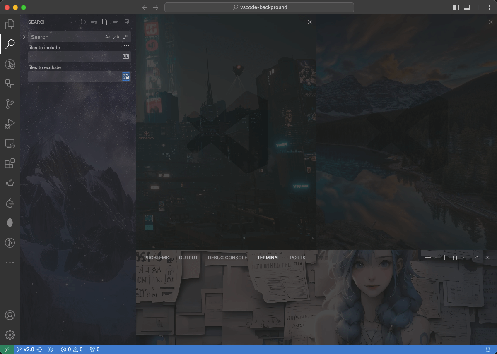
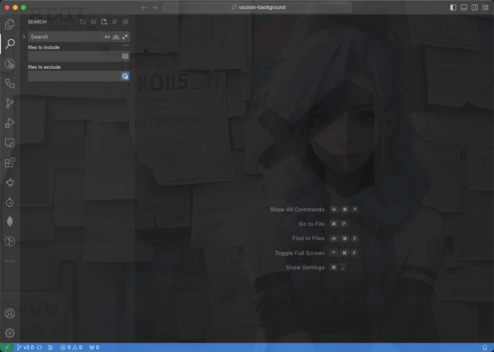
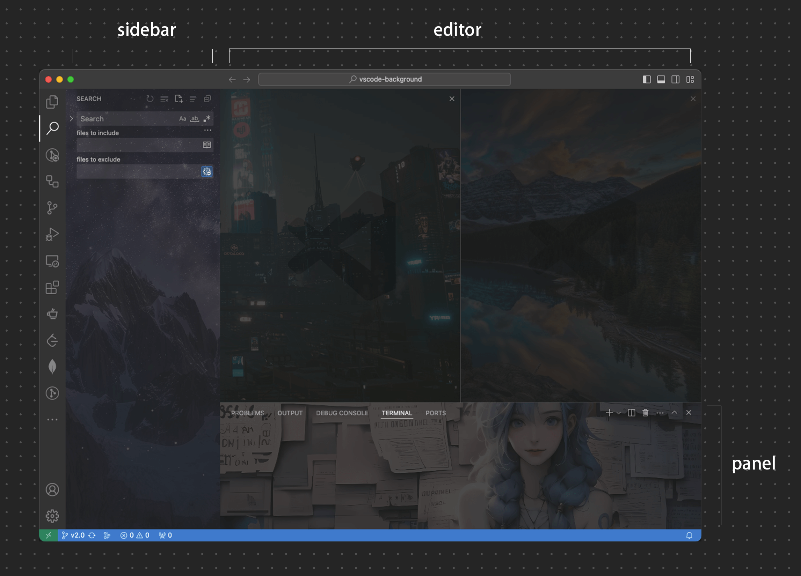
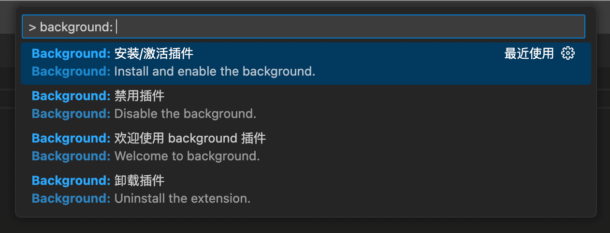

<!-- 中英文切换 -->
<div align="right">

[English](./README.md) | **中文** | [日本語](./README.ja-JP.md)

</div>
<!-- 中英文切换 end -->

<!-- 封面区域 -->
<div align="center">


<h1><b>vscode-background</b></h1>

### 给 [Visual Studio Code](https://code.visualstudio.com) 添加背景

`全屏`、`编辑器`、`侧边栏`、`辅助栏(auxiliarybar)`、`面板`、`轮播`、`自定义图片/样式`...

[GitHub](https://github.com/shalldie/vscode-background) | [Visual Studio Marketplace](https://marketplace.visualstudio.com/items?itemName=shalldie.background)

[](https://marketplace.visualstudio.com/items?itemName=shalldie.background)
[](https://github.com/shalldie/vscode-background)
[](https://github.com/shalldie/vscode-background/actions)
[](https://github.com/shalldie/vscode-background)

多区域，`编辑器`、`侧边栏`、`辅助栏(auxiliarybar)`、`面板`



`全屏`



</div>

<!-- 封面区域 end -->

## 安装

有两种安装方式：

1. 从 [Visual Studio Marketplace](https://marketplace.visualstudio.com/items?itemName=shalldie.background) 安装。
2. 在 vscode 里搜索 `shalldie.background`。

## 自定义

可以通过调整配置（`settings.json`）来满足个性化需求。

[`settings.json` 是什么](https://code.visualstudio.com/docs/getstarted/settings#_settingsjson) | [怎么打开](https://github.com/shalldie/vscode-background/issues/274)

## 配置项



### 全局配置

| 名称                 |   类型    | 默认值 | 描述         |
| :------------------- | :-------: | :----: | :----------- |
| `background.enabled` | `Boolean` | `true` | 插件是否启用 |

### Editor 编辑器区域配置

通过 `background.editor` 设置编辑器区域配置。

| 名称       |    类型    |    默认值    | 描述                                                   |
| :--------- | :--------: | :----------: | :----------------------------------------------------- |
| `useFront` | `boolean`  |    `true`    | 把图片放在代码的上方或下方。                           |
| `style`    |  `object`  |     `{}`     | 自定义图片样式。 [MDN Reference][mdn-css]              |
| `styles`   | `object[]` | `[{},{},{}]` | 为每一个图片自定义样式。                               |
| `images`   | `string[]` |     `[]`     | 自定义图片，支持在线和本地图片，以及文件夹。           |
| `interval` |  `number`  |     `0`      | 单位 `秒`，轮播时候图片切换间隔，默认 `0` 表示不开启。 |
| `random`   | `boolean`  |   `false`    | 是否随机展示图片。                                     |

[mdn-css]: https://developer.mozilla.org/docs/Web/CSS

example:

```json
{
  "background.editor": {
    "useFront": true,
    "style": {
      "background-position": "100% 100%",
      "background-size": "auto",
      "opacity": 0.6
    },
    "styles": [{}, {}, {}],
    // `images` 支持在线和本地图片，以及文件夹。
    "images": [
      // 在线图片，只允许 `https` 协议
      "https://hostname/online.jpg",
      // 本地图片
      "file:///local/path/img.jpeg",
      "/home/xie/downloads/img.gif",
      "C:/Users/xie/img.bmp",
      "D:\\downloads\\images\\img.webp",
      // 文件夹
      "/home/xie/images",
      // data URL
      "data:image/*;base64,<base64-data>"
    ],
    "interval": 0,
    "random": false
  }
}
```

### 全屏、侧边栏、辅助栏(auxiliarybar)、面板 区域配置

通过 `background.fullscreen`、`background.sidebar`、`background.auxiliarybar`、`background.panel` 来进行这些区域的配置。

| 名称       |    类型    |  默认值  | 描述                                                                         |
| :--------- | :--------: | :------: | :--------------------------------------------------------------------------- |
| `images`   | `string[]` |   `[]`   | 自定义图片，支持在线和本地图片，以及文件夹。                                 |
| `opacity`  |  `number`  |  `0.1`   | 透明度，等同 css [opacity][mdn-opacity]，建议 `0.1 ~ 0.3`。                  |
| `size`     |  `string`  | `cover`  | 等同 css [background-size][mdn-background-size], 建议使用 `cover` 来自适应。 |
| `position` |  `string`  | `center` | 等同 css [background-position][mdn-background-position]， 默认值 `center`。  |
| `interval` |  `number`  |   `0`    | 单位 `秒`，轮播时候图片切换间隔，默认 `0` 表示不开启。                       |
| `random`   | `boolean`  | `false`  | 是否随机展示图片。                                                           |

[mdn-opacity]: https://developer.mozilla.org/docs/Web/CSS/opacity
[mdn-background-size]: https://developer.mozilla.org/docs/Web/CSS/background-size
[mdn-background-position]: https://developer.mozilla.org/docs/Web/CSS/background-position

example:

```json
{
  "background.fullscreen": {
    // `images` 支持在线和本地图片，以及文件夹。
    "images": [
      // 在线图片，只允许 `https` 协议
      "https://hostname/online.jpg",
      // 本地图片
      "file:///local/path/img.jpeg",
      "/home/xie/downloads/img.gif",
      "C:/Users/xie/img.bmp",
      "D:\\downloads\\images\\img.webp",
      // 文件夹
      "/home/xie/images",
      // data URL
      "data:image/*;base64,<base64-data>"
    ],
    "opacity": 0.1,
    "size": "cover",
    "position": "center",
    "interval": 0,
    "random": false
  },
  // `sidebar`、`panel` 的配置与 `fullscreen` 一致
  "background.sidebar": {},
  "background.panel": {}
}
```

## 快捷命令

点击状态栏右下角「Background」按钮，可以快速弹出 background 所有命令：



## 常见问题

> **本插件是通过修改 vscode 的 html 文件的方式运行**

如果遇到问题请查看 [常见问题](docs/common-issues.zh-CN.md)

## 卸载

请查看 [常见问题#如何删除插件](docs/common-issues.zh-CN.md#如何删除插件)

## 感谢这些朋友的 pr 🙏

[](https://github.com/shalldie)
[](https://github.com/suiyun39)
[](https://github.com/frg2089)
[](https://github.com/AzureeDev)
[](https://github.com/tumit)
[](https://github.com/asurinsaka)
[](https://github.com/u3u)
[](https://github.com/kuresaru)
[](https://github.com/Unthrottled)
[](https://github.com/rogeraabbccdd)
[](https://github.com/SatoMasahiro2005)

## 贡献指南

这里是 [贡献指南](docs/contributing.zh-CN.md)。

## 更新日志

可以从 [这里](https://github.com/shalldie/vscode-background/blob/master/CHANGELOG.md) 查看所有的变更内容。

## 分享图片

我们在 [这里](https://github.com/shalldie/vscode-background/issues/106) 分享背景图。

## 从 v1 迁移

v1 的配置已经过时，当前保持一定的兼容性，请参考 [migration-from-v1.md](docs/migration-from-v1.md) 进行迁移。

## 协议

MIT
