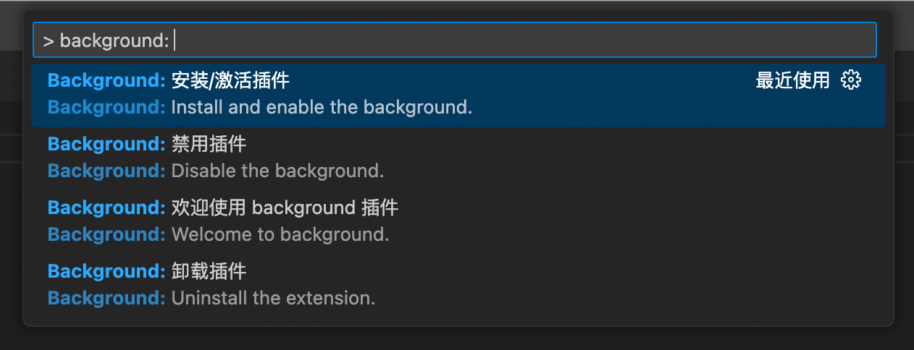

# vscode-background

Welcome to use `background@${VERSION}`, the new version has more features and will bring you a better coding experience!

## More configurable sections

Each section can be customized with features such as `custom images/styles`、`carousel`、`random display`...


## Clear and concise configuration

Each section has independent configuration, see [README.md](https://github.com/shalldie/vscode-background) to learn more.

```json
{
  "background.sidebar": {...},   // sidebar
  "background.editor": {...},    // editor
  "background.panel": {...},     // panel
  "background.fullscreen": {...} // fullscreen
}
```

## Quick Command

Click the 「Background」 button on the right-bottom of statusbar, all commands of `background` will appear:



## No more warnings

No more warnings about `Your Code installation appears to be corrupt`.

## Migration from v1

> The configuration of v1 is outdated and needs to be migrated. Currently maintaining a certain level of compatibility.

v1:

```json
{
  "background.useFront": true,
  "background.customImages": [],
  "background.interval": 0,
  "background.style": {},
  "background.styles": []
}
```

v2, migrated to `background.editor`:

```json
{
  "background.editor": {
    "useFront": true,
    "images": [],
    ...
  }
}
```
